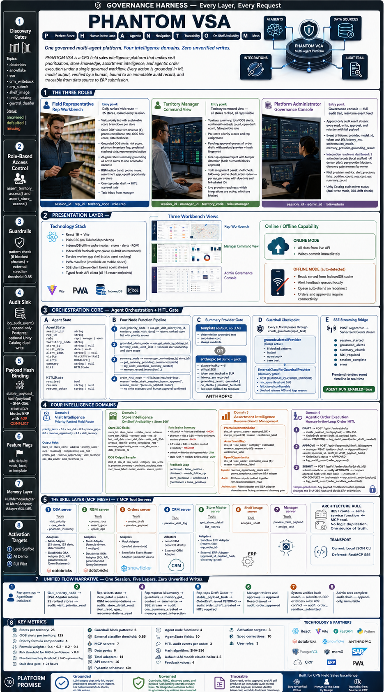
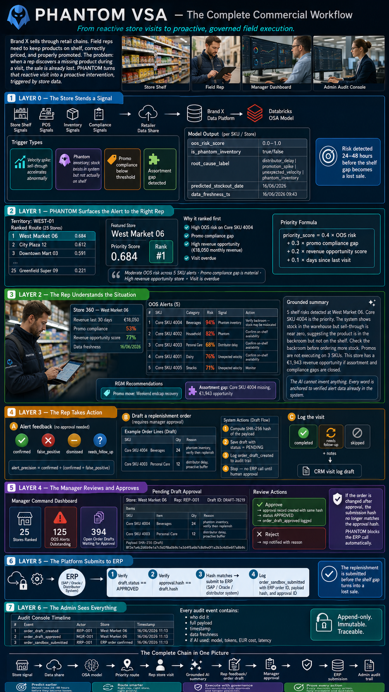

# PHANTOM VSA

**P**erfect Store · **H**uman-in-the-Loop · **A**gentic · **N**avigation · **T**raceability · **O**n-Shelf Availability · **M**esh

> A governed multi-agent field sales assistant for CPG organisations.
> Every AI output is grounded. Every write action requires human approval.
> Every event is immutably audited — from data source to ERP submission.

---



---

## The Complete Commercial Workflow

*From reactive store visits to proactive, governed field execution.*



---

## What This Is

PHANTOM VSA is a production-architecture CPG field sales intelligence platform built on a governed multi-agent design. It gives field representatives, territory managers, and platform administrators a unified workflow across four intelligence domains:

| Domain | What it does |
|---|---|
| **Visit Intelligence** | Ranks a rep's daily store route by a weighted OSA + RGM + recency formula. Delivers explainable priority reasons per store. |
| **Know Your Store** | Surfaces ML-predicted on-shelf availability (OOS) alerts per SKU per store. A deterministic rule engine converts risk scores into grounded actions with confidence labels. |
| **Assortment Mentalization** | Generates Revenue Growth Management recommendations — promo moves, assortment gaps, and upsell opportunities — scored against store revenue and compliance signals. |
| **Agentic Order Execution** | Lets a rep draft replenishment orders against OOS alerts. Every draft is cryptographically hash-bound. No ERP write executes without verified manager approval. |

---

## Architecture at a Glance

```
┌─────────────────────────────────────────────────────────────┐
│  PRESENTATION  React 18 PWA — rep workbench / manager       │
│                command view / admin governance console       │
│                Offline-capable · IndexedDB · SSE stream     │
├─────────────────────────────────────────────────────────────┤
│  ORCHESTRATION  AgentState → 4 async node functions         │
│                 Guardrail gate → Memory injection →         │
│                 LLM summary (claude-haiku-4-5, gated) →    │
│                 HITL gate → Audit event                     │
├───────────────────────────┬─────────────────────────────────┤
│  VISIT        STORE       │  ASSORTMENT    ORDER EXECUTION  │
│  INTELLIGENCE INTELLIGENCE│  INTELLIGENCE  HITL pipeline    │
│  Priority     OOS alerts  │  RGM promos    draft→approve    │
│  formula      rule engine │  assortment    →hash verify     │
│  0.4/0.3/0.2/ action +   │  gaps + upsell →ERP submit      │
│  0.1 weights  confidence  │                                 │
├───────────────────────────┴─────────────────────────────────┤
│  MCP SKILL LAYER  7 servers sharing the same adapter layer  │
│  osa · rgm · orders · crm · store_master · shelf_image ·   │
│  manager — local JSON CLI transport, FastMCP SSE deferred   │
├─────────────────────────────────────────────────────────────┤
│  DATA LAYER  Port/Adapter/Factory pattern                   │
│  6 ports × 14 adapters — mock default, Databricks/         │
│  Snowflake/CRM/ERP/shelf-image adapters discovery-gated     │
├─────────────────────────────────────────────────────────────┤
│  GOVERNANCE HARNESS  (wraps every layer)                    │
│  Discovery gates · RBAC · Guardrails · AuditSink ·          │
│  Payload hash binding · Feature flags · Memory port ·       │
│  3-stage activation ladder (local → AI demo → pilot)        │
└─────────────────────────────────────────────────────────────┘
```

---

## Key Design Decisions

### Human-in-the-Loop by Protocol

No ERP write executes without a verified human approval chain. The order HITL pipeline computes a SHA-256 hash of every draft payload at creation. The same hash is stored independently in the approval record. At submission time, the system verifies both hashes match before calling the ERP adapter — any post-approval tampering produces a `409 CONFLICT` and the ERP call is blocked.

```
draft created  →  SHA-256(payload)  →  OrderDraft.payload_hash
               →  ApprovalRecord.draft_payload_hash  (independent copy)
               →  submit: assert both hashes equal  →  ERP call
```

### Port / Adapter / Factory — One Source of Truth

Every external integration (Databricks OSA, Databricks RGM, Snowflake store master, CRM, ERP, shelf image) follows the same three-layer pattern:

```
*Port (Protocol)  →  *Adapter (mock | local | sandbox | live)  →  factory.py
```

REST routes and MCP tools call the same adapter and service functions. No logic is duplicated between the API surface and the tool layer.

### Governance Before Integration

Discovery gates enforce that every client-specific answer (data residency, CRM platform, ERP endpoint, SSO provider) is recorded before any live adapter can be constructed. `assert_discovery_ready(topic)` fires at adapter construction time — not at first query. A missing answer prevents the adapter from being built at all.

### Feature Flags at Every Boundary

Every integration that is not yet production-ready sits behind a named feature flag with a safe default:

```
SUMMARY_PROVIDER=template      (→ anthropic for AI demo)
AGENT_GRAPH_ENABLED=false      (graph scaffold ready, not active)
AUTH_MODE=mock_jwt             (→ external_jwt after SSO discovery)
MEMORY_PROVIDER=none           (→ mem0 after retention approval)
AUDIT_DUAL_WRITE_ENABLED=false (→ true after Unity Catalog provisioned)
ERP_ADAPTER=sandbox            (→ external after ERP discovery)
```

### Grounded AI — No Hallucination Surface

The LLM summary path (`SUMMARY_PROVIDER=anthropic`) receives only alert IDs already retrieved and RBAC-verified from the OSA adapter. The prompt is constructed from structured data already in the system. The model cannot invent store names, SKU IDs, or risk values.

---

## Governance Architecture

| Control | Mechanism | Location |
|---|---|---|
| Discovery gates | `assert_discovery_ready(topic)` at adapter construction | `governance/discovery.py` |
| Role-based access | `assert_territory_access`, `assert_store_access` per request | `governance/rbac.py` |
| Guardrails | Pattern blocklist (always) + external classifier (gated, threshold 0.85) | `governance/guardrails.py` |
| Audit sink | `log_audit_event()` → append-only Postgres; Unity Catalog dual-write scaffolded | `services/audit.py` |
| Payload hash binding | SHA-256 at draft creation, verified at ERP submission | `services/hashing.py` |
| Feature flags | Named env vars, safe defaults, documented in `.env.example` | `config.py` |
| Memory scope | MemoryPort Protocol, NullAdapter default, Mem0 discovery-gated | `memory/` |
| Activation ladder | local scaffold → AI demo → full pilot, tracked via readiness endpoints | `governance/activation.py` |

---

## Technology Stack

| Layer | Technology |
|---|---|
| Backend | Python 3.11+, FastAPI, SQLAlchemy async, Alembic, Pydantic v2 |
| LLM | Anthropic Python SDK, `claude-haiku-4-5` (configurable), gated by `SUMMARY_PROVIDER` |
| Database | SQLite (local / test), PostgreSQL (production) |
| Frontend | React 18, Vite, IndexedDB, Service Worker, SSE client |
| Testing | pytest, Playwright (E2E workbench smoke) |
| CI | GitHub Actions — lint, tests, eval harness, migration smoke, frontend build, public-safety scan |
| Data integration | Databricks SQL API (OSA + RGM), Snowflake SQL API (store master), parameterized `QueryStatement` builders |
| MCP | Local JSON CLI transport, 7 servers sharing the backend adapter layer |
| Observability | Structured request logging, OTLP HTTP export boundary (gated) |

---

## Scale at a Glance

| | |
|---|---|
| API endpoints | 30+ across 16 routers |
| Pydantic schemas | 40+ request / response models |
| MCP servers | 7 (OSA, RGM, CRM, orders, store master, shelf image, manager) |
| Data ports | 6 with 14 adapters |
| Agent node functions | 4 (`visit_priority`, `grounded_alerts`, `summary`, `order_hitl`) |
| Audit event types | 30+ defined, all append-only |
| HITL chain steps | 3 (draft → approve → submit) with hash verification at each boundary |
| Feature flags | 12 integration boundaries |
| Activation targets | 3 (local scaffold, AI demo, full pilot) |
| Spec corrections | 10 permanent architectural overrides, each with rationale |

---

## Quick Start

### Backend

```bash
cd backend
python -m venv .venv
source .venv/bin/activate        # macOS / Linux
# .venv\Scripts\Activate.ps1    # Windows PowerShell
pip install -e ".[dev]"
alembic upgrade head
uvicorn backend.main:app --reload --host 0.0.0.0 --port 8000
```

Demo bearer token for `REP-001` (mock JWT, no signature):

```
Bearer eyJhbGciOiJub25lIiwidHlwIjoiSldUIn0.eyJzdWIiOiJSRVAtMDAxIiwidGVycml0b3J5X2NvZGUiOiJXRVNULTAxIiwicm9sZSI6InJlcCJ9.
```

### Frontend

```bash
cd frontend
npm ci
npm run dev -- --host 127.0.0.1 --port 5173
```

Open `http://localhost:5173`. Use the role switcher to move between Rep, Manager, and Admin views.

### Verify the full local stack

```bash
python scripts/local_dev_smoke.py --output-dir artifacts/local-dev-smoke
```

---

## API Surface

### Core sales workflow

```
GET  /api/v1/health                              System and provider health
GET  /api/v1/health/{ai,auth,data-platform,...}  Per-provider readiness
GET  /api/v1/integrations/readiness              Activation targets + blocker list
GET  /api/v1/integrations/pilot-gap-report       Owner-mapped pilot blockers + next commands
GET  /api/v1/integrations/activation-runbook     Final VSA phase plan + exit gates
GET  /api/v1/integrations/discovery-packet       Owner-grouped client discovery checklist
GET  /api/v1/integrations/ai-demo-activation-pack  Public-safe real-AI demo activation proof
GET  /api/v1/visits/today                        Ranked visit route (territory-scoped)
GET  /api/v1/stores/{store_id}                   Store 360° view
GET  /api/v1/stores/{store_id}/alerts            OOS alerts with rule engine output
GET  /api/v1/stores/{store_id}/rgm-recommendations  Promo, gap, and upsell recommendations
POST /api/v1/stores/{store_id}/shelf-image-analysis  Shelf image analysis (mock default)
POST /api/v1/alerts/{alert_id}/feedback          Rep confirms / dismisses / flags alert
POST /api/v1/agent/osa-summary                   Grounded OSA summary (LLM or template)
POST /api/v1/agent/run                           SSE supervisor/action stream (event-by-event)
GET  /api/v1/audit/session/{session_id}          Full session audit trail
```

### HITL order and manager workflow

```
POST /api/v1/orders/drafts                       Create order draft (hash computed)
GET  /api/v1/orders/drafts/{draft_id}            Retrieve draft with payload hash
POST /api/v1/approvals/{draft_id}/approve        Manager approves (hash stored)
POST /api/v1/approvals/{draft_id}/reject         Manager rejects
POST /api/v1/orders/drafts/{draft_id}/submit-sandbox  Submit after hash verification
POST /api/v1/crm/visit-log-drafts                CRM visit log draft
POST /api/v1/sync/feedback-events                Offline feedback queue sync
GET  /api/v1/manager/territory-summary           All stores ranked per territory
GET  /api/v1/manager/approval-queue              All pending order drafts
POST /api/v1/manager/tasks                       Assign task to rep
GET  /api/v1/manager/tasks                       List tasks (filterable by status)
POST /api/v1/manager/tasks/{task_id}/status      Rep updates task status
GET  /api/v1/metrics/pilot                       Alert precision, summary count, cost
GET  /api/v1/admin/audit-events                  Admin audit feed (cursor-paginated)
GET  /api/v1/admin/audit-events/{event_id}       Single event detail
```

---

## MCP Tool Layer

Seven MCP servers share the same backend adapter and service layer as the REST API. No logic is duplicated between the two surfaces.

```bash
# List tools for a server
python -m mcp.osa.server --list

# Call a tool directly
python -m mcp.osa.server --call get_visit_priority \
  --args-json '{"rep_id":"REP-001","territory_code":"WEST-01","visit_date":"2026-06-16"}'
```

Available servers: `osa`, `rgm`, `crm`, `orders`, `store_master`, `shelf_image`, `manager`

---

## CI Pipeline

Every push runs three GitHub Actions jobs:

| Job | What it checks |
|---|---|
| `backend` | ruff lint, pytest, OSA eval harness, readiness report, contract manifest, MCP smoke, Alembic migration smoke, readiness bundle |
| `frontend` | npm build, Playwright workbench smoke (rep route → store → alerts → summary → feedback) |
| `public-safety` | Scans for accidental credential markers, absolute machine paths, and internal document references |

```bash
python scripts/run_eval.py                                    # eval harness
python scripts/pilot_readiness_report.py --target local       # readiness
python scripts/pilot_readiness_report.py --target ai-demo     # AI demo gate
python scripts/pilot_activation_runbook.py --target pilot      # final VSA phase plan
```

---

## Pilot Activation Ladder

```
LOCAL SCAFFOLD   All mock adapters, HITL flow, audit trail, MCP smoke, CI green
      ↓
AI DEMO          SUMMARY_PROVIDER=anthropic, eval validated, AI_DEMO_EVAL_VALIDATED=true
      ↓
FULL PILOT       Live data adapters, real SSO, real ERP/CRM, Unity Catalog audit,
                 all discovery questions answered
```

```bash
GET /api/v1/integrations/readiness     # current target status and blockers
GET /api/v1/integrations/pilot-gap-report?target=pilot
GET /api/v1/integrations/activation-runbook?target=pilot
GET /api/v1/integrations/discovery-packet?target=pilot
GET /api/v1/integrations/ai-demo-activation-pack
```

---

## Documentation

| Document | Purpose |
|---|---|
| [docs/spec-compliance.md](docs/spec-compliance.md) | Implementation posture vs. original brief — built, deferred, remaining |
| [docs/implementation-continuation-plan.md](docs/implementation-continuation-plan.md) | Chunk order, locked decisions, completed work log |
| [docs/spec-corrections.md](docs/spec-corrections.md) | 10 permanent architectural corrections with rationale |
| [docs/pilot-activation-runbook.md](docs/pilot-activation-runbook.md) | Step-by-step activation gates for each target |
| [docs/architecture-ontology.md](docs/architecture-ontology.md) | Public-safe ontology, topology, and end-to-end data flow |
| [docs/infographic-5-unified-platform.md](docs/infographic-5-unified-platform.md) | Full content brief behind the architecture infographic above |
| [docs/pilot-metrics.md](docs/pilot-metrics.md) | KPI definitions, eval commands, pilot metric queries |
| [docs/client-discovery.md](docs/client-discovery.md) | Discovery questions required before any live integration activates |
| [AGENTS.md](AGENTS.md) | Agent gate for AI coding sessions — conventions, locked decisions, safety rules |

---

## Security Model

- **No credentials in this repository.** The Databricks bearer token is intentionally absent from `.env.example` and provisioned through an approved secret channel at activation.
- **Public-safety scan** runs on every push and blocks commits containing credential markers, absolute machine paths, or internal document references.
- **Mock JWT** is the default auth mode. External JWT with JWKS validation, issuer, audience, and claim mapping is scaffolded behind `AUTH_MODE=external_jwt`, gated on SSO discovery.
- **Append-only audit trail.** There are no update or delete paths for audit events anywhere in the codebase.
- **Guardrails before every LLM call.** Pattern check runs unconditionally. External classifier available at threshold 0.85 with configurable fail-closed mode.

---

## Repository Conventions

Built under a Spec-Driven Development (SDD) framework:

```
Spec → Agent Gate (AGENTS.md) → Compliance Tracking → Task Order → Verification
```

- [`AGENTS.md`](AGENTS.md) is the authoritative gate for every AI coding session — read before any code change
- [`docs/spec-corrections.md`](docs/spec-corrections.md) records permanent deviations from the original brief with rationale
- [`docs/spec-compliance.md`](docs/spec-compliance.md) tracks the current implementation posture section by section
- Every new integration boundary gets a feature flag, a health endpoint, a discovery gate, and a dry-run smoke artifact before any credentialed activation
